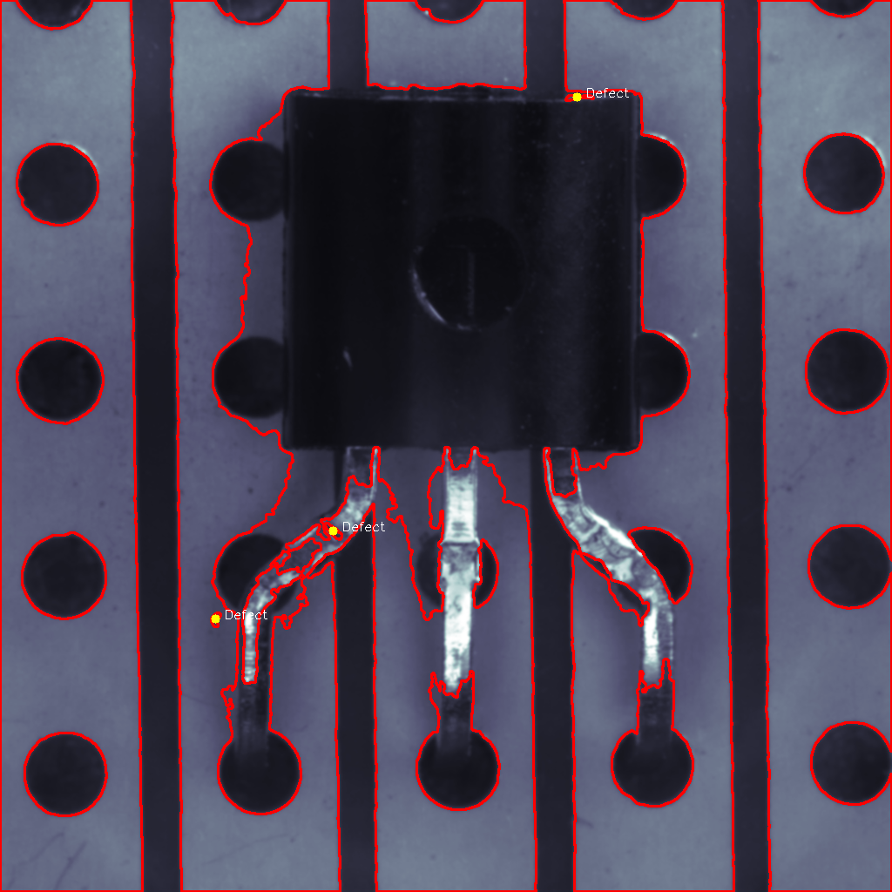
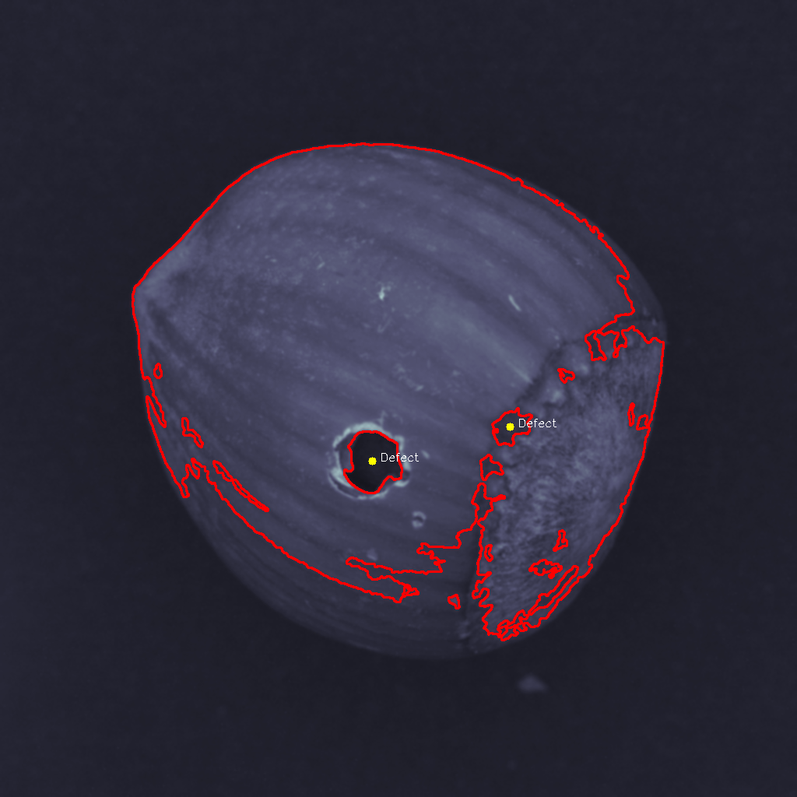

# OpenCV + ONNX 기반 불량 검출 실습 프로젝트


---

## 프로젝트 소개 (2025.04.20 ~ 2025.04.24)

본 프로젝트는 ChatGPT를 참고하고 GitHub Copilot의 도움을 받아, OpenCV와 C++를 활용한 이미지 처리 및 불량 검출을 5일간 실습한 것입니다.

 1. OpenCV 기반의 전처리와 외곽선 검출을 통해 결함을 시각적으로 표현 
 
 2. 템플릿 매칭 기반 유사도 판별
 
 3. PyTorch로 학습한 CNN 분류 모델을 ONNX 형식으로 변환하여 C++ 환경에서 불량 검출

### 주요 기능
- X-ray 스타일 필터 (ColorMap 적용)
- 외곽선 기반 결함 시각화
- 템플릿 매칭 기반 유사도 판별
- ONNX 모델을 이용한 다중 클래스 분류 추론 (OpenCV DNN 모듈 사용)

---

## 결과 예시
### 1. OpenCV 기반의 전처리와 외곽선 검출 통해 결함을 시각적으로 표현 



### 2. 템플릿 매칭 기반 유사도 판별


### 3. PyTorch로 학습한 CNN 분류 모델을 ONNX 형식으로 변환하여 C++ 환경에서 불량 검출

ONNX 모델은 숫자 인덱스로 클래스를 반환하므로, 아래와 같이 매핑됩니다:
```python
{'crack': 0, 'cut': 1, 'good': 2, 'hole': 3, 'print': 4}
```


## 딥러닝 기반 분류 모델 실험

처음에는 PyTorch로 간단한 CNN 모델을 구현하여 hazelnut 데이터셋을 분류하였습니다.  
아래는 에폭 수에 따른 정확도 변화입니다:

| 모델 | 에폭 | 테스트 정확도 |
|------|------|----------------|
| 기본 CNN (3 Conv) | 10 | 약 25% |
| 기본 CNN (30 Epoch) | 30 | 약 5% |
| ✅ ResNet18 (사전학습) | 10 | 100% |

기본 CNN 구조는 데이터셋에 비해 모델이 지나치게 단순하여,  
오히려 학습이 진행될수록 정확도가 낮아지는 현상이 나타났습니다.

이에 따라 사전학습된 ResNet18 모델을 도입하고,  
클래스 수를 5개로 설정한 뒤 마지막 레이어만 수정하여 재학습을 진행한 결과,  
테스트셋에서 100% 정확도를 얻을 수 있었습니다.

## 폴더 구조

```text
opencvTest/
├── hazelnut/
│   ├── train/               # 테스트 이미지(단순하게 정확도 측정을 위해 반대로 하였음)
│   │   └── good/            
│   └── test/                # 학습용 이미지(분류해서 훈련시키기 위해 반대로 하였음)
│       ├── good/
│       ├── crack/
│       ├── cut/
│       ├── hole/
│       └── print/
├── opencvTest1.cpp          # C++ 메인 추론 코드
├── hazel_model.onnx         # PyTorch → ONNX 모델
├── results/                 # 추론 결과 이미지 저장
└── Hazelnut Cnn Train.ipynb # CNN 학습용 Jupyter Notebook
```

## 데이터셋 출처

본 프로젝트는 MVTec Anomaly Detection Dataset (MVTec AD)를 사용합니다.

- Dataset: [MVTec AD](https://www.mvtec.com/company/research/datasets/mvtec-ad)
- License: CC BY-NC-SA 4.0


